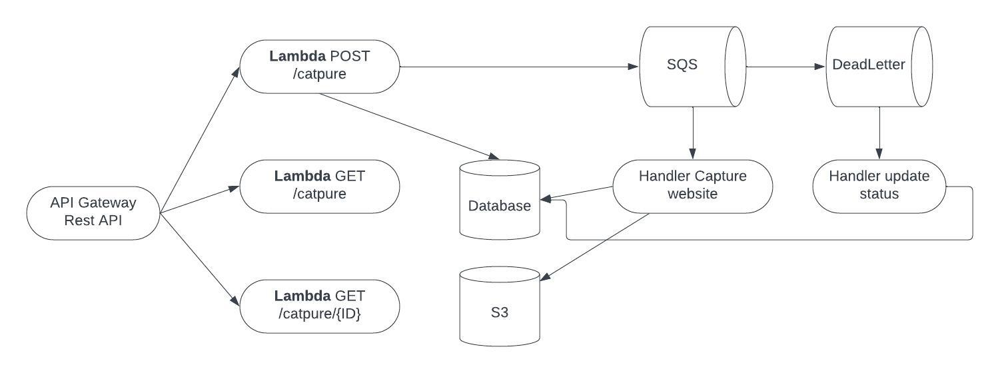
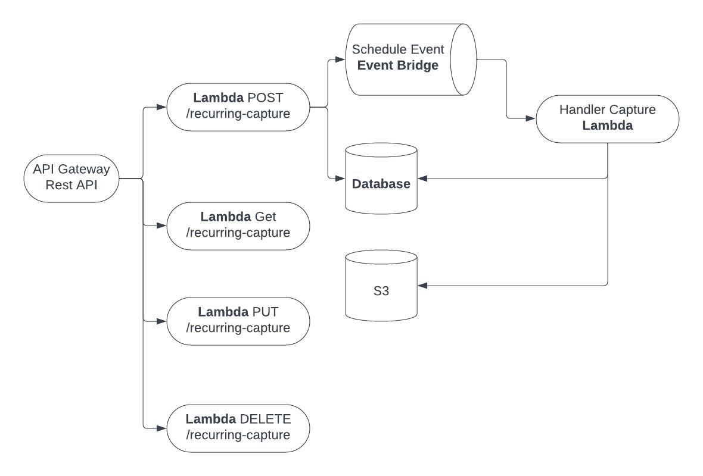

# TODO

- Auto setup chromium

## Getting started

```bash
pnpm install && NODE_ENV=development node ./setup.js
```

Set sst secrets

```bash
npx sst secrets set POSTGRES_URL "postgres://..."
```

<!-- markdown insert image -->


<!-- markdown flow chart capture -->



<!-- markdown flow chart recurring -->



## Develop

```bash
pnpm run dev
```

## Deploy

```bash
pnpm run deploy --stage prod
```
