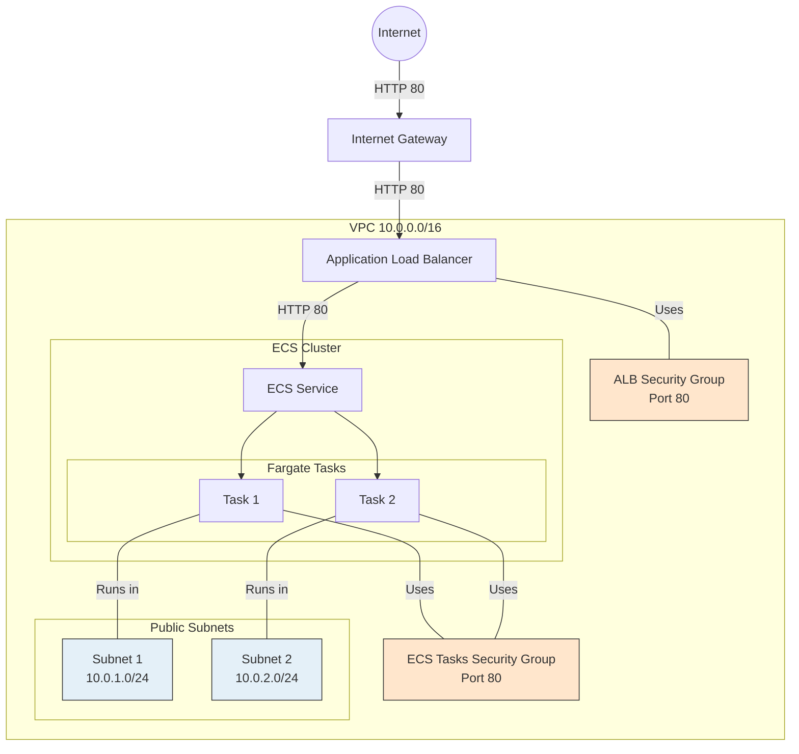

# Authenticate to ECR
aws ecr get-login-password --region ap-southeast-1 | docker login --username AWS --password-stdin $(terraform output -raw ecr_repository_url)

# Build and tag your image
docker build -t website-capture .
docker tag website-capture:latest $(terraform output -raw ecr_repository_url):latest

# Push the image
docker push $(terraform output -raw ecr_repository_url):latest

