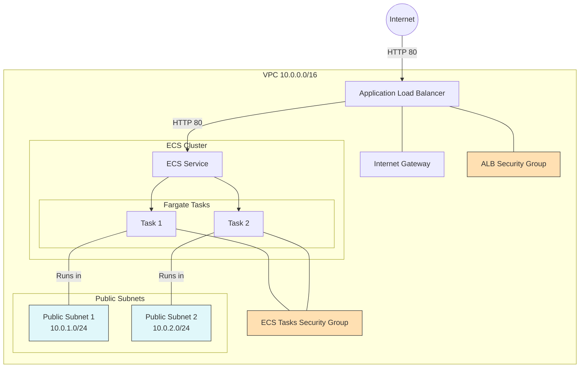

```mermaid
graph TD
    subgraph VPC[VPC 10.0.0.0/16]
        IGW[Internet Gateway]
        
        subgraph PublicSubnets[Public Subnets]
            PS1[Public Subnet 1<br/>10.0.1.0/24]
            PS2[Public Subnet 2<br/>10.0.2.0/24]
        end
        
        ALB[Application Load Balancer]
        
        subgraph ECSCluster[ECS Cluster]
            Service[ECS Service]
            subgraph Tasks[Fargate Tasks]
                T1[Task 1]
                T2[Task 2]
            end
        end
        
        SG_ALB[ALB Security Group]
        SG_ECS[ECS Tasks Security Group]
    end
    
    Internet((Internet))
    
    Internet -->|HTTP 80| ALB
    ALB -->|HTTP 80| Service
    Service --> T1
    Service --> T2
    
    ALB --- SG_ALB
    T1 --- SG_ECS
    T2 --- SG_ECS
    
    ALB --- IGW
    
    T1 ---|Runs in| PS1
    T2 ---|Runs in| PS2
    
    classDef subnet fill:#e0f7fa,stroke:#333
    classDef sg fill:#ffe0b2,stroke:#333
    class PS1,PS2 subnet
    class SG_ALB,SG_ECS sg
```